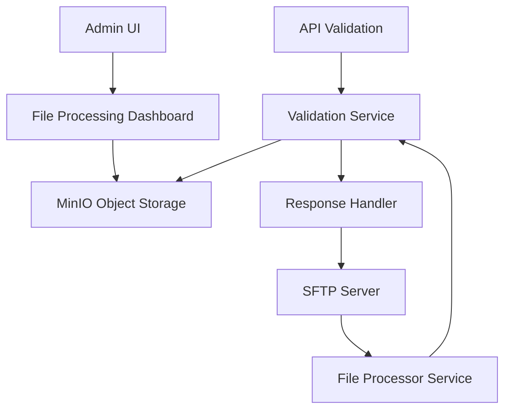

# EDI Lens - Claude Development Documentation

This file tracks development progress, implementation details, and important context for ongoing features.

## Current Feature: SFTP File Processing

### Overview
Implementing SFTP-based file processing to allow trading partners to upload EDI files to designated directories for automated processing, alongside the existing API-based validation.

### Key Requirements
- **Dual Processing**: API validation continues unchanged, SFTP is purely additive
- **Individual Partner Credentials**: Each partner gets unique SFTP credentials
- **Configurable Polling**: Per-partner file polling schedules (cron-based)
- **Regex File Patterns**: Configurable filename patterns for collection
- **Response Delivery**: TA1 acknowledgments delivered to partner outbound folders
- **File Archiving**: Default to object storage (existing behavior continues)
- **File Locking**: Prevent concurrent processing of same file
- **Configurable Response Naming**: Template-based or regex-based response filenames
- **Dashboard & Logging**: UI for viewing processed files, download capabilities
- **File Size Limits**: 50MB browser viewing limit, larger files download-only

### Architecture Design



### Implementation Progress

#### ✅ Phase 1: Database Schema & Models (COMPLETED)

**Database Tables Created:**
- `processing_schedules` - Cron-based polling schedules (6 default schedules)
- `sftp_configurations` - Per-partner SFTP settings with auth options
- `file_processing_logs` - File processing tracking and status with locking
- Enhanced `validation_transactions` with SFTP source tracking fields

**Models Implemented:**
- `ProcessingSchedule` - Schedule management with cron expressions
- `SftpConfiguration` - Partner SFTP configuration (password/SSH key auth)
- `FileProcessingLog` - File processing tracking with locking and retry logic
- Enhanced `ValidationTransaction` - Added SFTP source tracking fields

**Key Model Features:**
- File locking mechanism with timeouts (`locked_by`, `lock_expires_at`)
- Retry logic with configurable limits (`retry_count`, `max_retries`)
- Response delivery tracking (`response_delivered`, `delivery_attempts`)
- Authentication types: password/SSH key/both
- File size limits and regex patterns per partner
- Archive location tracking in object storage
- Business logic methods (`can_retry`, `processing_duration_seconds`, etc.)

**Migration Applied:**
- ✅ Created all tables with proper relationships and foreign keys
- ✅ Added 6 default processing schedules (5min, 15min, hourly, business hours, daily, manual)
- ✅ Enhanced validation_transactions with SFTP fields (source_type, source_partner_id, etc.)
- ✅ Proper enum handling for SourceType (API/SFTP/MANUAL)
- ✅ Unique constraints for tenant+partner SFTP configurations

**Testing Status:**
- ✅ Unit tests: 15/15 passing (pure logic, no database)
- ✅ Integration tests: 10/10 passing (database interaction tests)
- ✅ E2E validation: API validation still works unchanged (2/2 passing)

**Test Coverage:**
- Unit tests cover enum values, business logic methods, and default values
- Integration tests cover database operations, relationships, and constraints
- All tests properly categorized (unit vs integration per project requirements)
- Fixed async fixture issues and greenlet problems in relationship tests

**API Compatibility:**
- ✅ Existing API validation continues to work without changes
- ✅ New fields have proper defaults (source_type=API, response_delivered=false)
- ✅ No breaking changes to existing functionality

#### ✅ Phase 1: COMPLETE - Database Schema & Models

**Successfully Delivered:**
- Complete database schema with 3 new tables + enhanced existing table
- Full SQLAlchemy async models with relationships and business logic
- Comprehensive test suite (15 unit + 10 integration tests)
- Database migration applied and verified
- API compatibility maintained

#### ✅ Phase 2: COMPLETE - SFTP Server Setup

**Successfully Delivered:**
- LinuxServer OpenSSH container configured and running on port 2222
- Docker Compose integration with persistent volumes (`sftp_data`, `sftp_partner_data`)
- Partner directory structure: `/sftp/partners/` with proper permissions
- Initialization scripts for automated setup
- Basic SFTP connectivity verified (default user: `sftpuser`/`changeme123`)

**Configuration Details:**
- **External Access**: `localhost:2222` 
- **Partner Root**: `/sftp/partners/` (ready for individual partner directories)
- **Directory Structure**: `inbound/`, `outbound/`, `archive/` per partner
- **Integration**: Connected to existing Docker network and dependent on backend service

**Ready for**: File processing service implementation and partner user management

#### 📋 Next Phases:

**Phase 3: File Processor Service**
- Background service with cron-based polling
- File discovery and pattern matching
- File locking and concurrent processing prevention
- Integration with existing validation service
- Queue-based processing (one file at a time per partner)

**Phase 4: Response Handler Service**
- Monitor completed validations
- Template-based filename generation
- TA1 response delivery to outbound directories
- Timeout handling and retry logic

**Phase 5: UI Extensions**
- SFTP configuration interface in partner management
- File processing dashboard with real-time status
- File viewing/download capabilities (respecting size limits)
- Processing logs and error viewing

### Technical Decisions

**Authentication:** 
- Hashed passwords in database for now
- SSH key support available
- Future: Keycloak integration consideration

**File Size Limits:**
- 50MB browser viewing limit
- Download-only for larger files
- Configurable per-partner limits

**Queue Processing:**
- Single file processor initially
- Sequential processing per partner
- Future: Configurable worker count

**File Deduplication:**
- Allow duplicate filenames
- File hash tracking for future alerting
- No automatic deduplication

### Docker Configuration

**New Services to Add:**
```yaml
sftp-server:
  image: lscr.io/linuxserver/openssh-server:latest
  # Individual partner credentials
  # Directory isolation

file-processor:
  # Background polling service
  # Integration with validation service
```

### Database Schema Details

**Key Relationships:**
- TradingPartner 1:1 SftpConfiguration
- SftpConfiguration 1:N FileProcessingLog
- FileProcessingLog 1:1 ValidationTransaction
- ProcessingSchedule 1:N SftpConfiguration

**Important Fields:**
- `source_type` enum: API/SFTP/MANUAL
- `response_delivered` boolean for tracking
- File locking with `locked_by`, `locked_at`, `lock_expires_at`
- Retry logic with `retry_count`, `max_retries`

### Testing Strategy

**Unit Tests:**
- Model creation and relationships
- Validation logic and constraints
- Business logic (locking, retry, etc.)

**Integration Tests:**
- End-to-end file processing flow
- SFTP server interaction
- Response delivery verification

**E2E Tests:**
- Complete partner workflow
- File upload → processing → response delivery
- Error handling scenarios

### Notes & Considerations

1. **API Compatibility**: All new fields have proper defaults, API processing unchanged
2. **Security**: Individual partner credentials, proper directory isolation
3. **Scalability**: Single processor initially, designed for future scaling
4. **Monitoring**: Comprehensive logging for troubleshooting
5. **Error Handling**: Retry logic, timeout handling, proper error states

---

## Development Commands

**Run Tests:**
```bash
./run.sh dev:test unit tests/core/test_sftp_models.py
./run.sh dev:test integration
./run.sh dev:test e2e
```

**Database:**
```bash
./run.sh dev:migrate:make "description"
./run.sh dev:migrate:run
```

**Development:**
```bash
./run.sh dev:start
./run.sh dev:logs
```