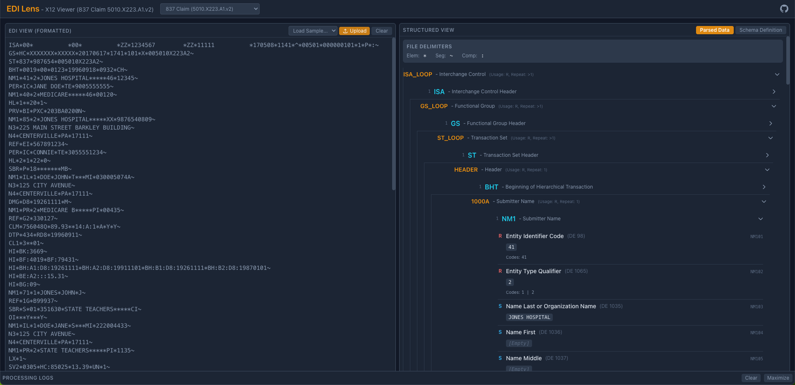

# EDI Lens - X12 Viewer

EDI Lens is a web-based developer tool designed to help view, parse, and understand the structure of X12 EDI (Electronic Data Interchange) files. It allows users to input raw EDI data, select a corresponding X12 schema definition, and visualize the data in both a formatted raw view and a structured, hierarchical view according to the selected schema.



## Live Demo

🚀 **Try EDI Lens live:**  
<a href="https://edi-lens.kreddys.com/" target="_blank" rel="noopener noreferrer">https://edi-lens.kreddys.com/</a>


## Features

*   **EDI Input:**
    *   Paste raw EDI text directly into the editor.
    *   Upload EDI files (`.edi`, `.txt`).
    *   Load pre-configured sample EDI files specific to the selected schema.
*   **Dynamic Schema Selection:**
    *   Automatically discovers available X12 schemas (in JSON format) from the `src/schemas/json` directory.
    *   Allows users to select the appropriate schema (e.g., 5010 837P, 837I, 835, 277CA).
    *   Schemas are loaded dynamically as needed.
*   **EDI Parsing:**
    *   Automatically detects element, segment, and component delimiters from the ISA segment (defaults if ISA is missing or invalid).
    *   Parses the EDI document into segments and elements.
    *   Handles standard segment terminators, including newlines.
*   **Hierarchical Data View:**
    *   Displays the parsed EDI data in a tree structure based on the loops and segments defined in the selected schema.
    *   Clearly shows nested loops and segment relationships.
    *   Allows expanding/collapsing loops and segments.
    *   Provides details for each element (Name, DE#, Usage, Valid Codes) based on the schema definition.
    *   Highlights segments that don't fit the schema ("Orphans") in the logs.
*   **Schema Structure View:**
    *   Displays the hierarchical definition *of the selected schema itself*, showing the expected order and nesting of loops and segments.
*   **Formatted EDI View:**
    *   Shows a cleaned-up version of the input EDI, using the detected segment delimiter for clear separation.
*   **Detailed Log Console:**
    *   Provides real-time feedback on the parsing and structure-building process.
    *   Logs informational messages, warnings (e.g., missing required segments, orphan segments), and errors.
    *   Color-coded log levels (DEBUG, INFO, WARN, ERROR).
    *   Can be maximized/minimized and cleared.

## Technology Stack

*   **Frontend Framework:** React 19 (with Hooks)
*   **Language:** TypeScript
*   **Build Tool:** Vite
*   **Styling:** Tailwind CSS
*   **Code Editor:** React Ace
*   **Testing:**
    *   Unit/Component: Vitest & React Testing Library
    *   E2E: Playwright (Setup included)

## Getting Started

### Prerequisites

*   Node.js (v18 or later recommended)
*   npm, yarn, or pnpm

### Installation & Running

1.  **Clone the repository:**
    ```bash
    git clone https://github.com/kreddys/edi-lens.git 
    cd edi-lens
    ```

2.  **Install dependencies:**
    ```bash
    npm install
    # or
    yarn install
    # or
    pnpm install
    ```

3.  **Run the development server:**
    ```bash
    npm run dev
    # or
    yarn dev
    # or
    pnpm dev
    ```

4.  Open your browser and navigate to the URL provided by Vite (usually `http://localhost:5173`).

## Usage

1.  **Select Schema:** Choose the appropriate EDI schema definition from the dropdown menu in the header. The application needs a schema to understand the structure of the EDI data.
2.  **Provide EDI Data:**
    *   Paste your raw EDI content into the left-hand panel ("EDI INPUT").
    *   Click the "Upload" button to select an EDI file from your computer.
    *   Select a sample file from the "Load Sample..." dropdown.
3.  **View Results:**
    *   **Left Panel:** After processing, this panel will switch to "EDI VIEW (FORMATTED)" showing the cleaned-up input.
    *   **Right Panel ("Structured View"):**
        *   **Parsed Data Tab:** Explore the hierarchical structure of your EDI data. Expand loops and segments to see details and element definitions. Check the delimiters detected.
        *   **Schema Definition Tab:** View the official structure defined by the selected schema JSON.
    *   **Log Console:** Check the bottom panel for detailed processing information, warnings, or errors. Maximize it for more details.

## Adding Schemas

1.  Obtain the EDI schema definition in the specific JSON format expected by the application (containing `transactionName`, `segmentDefinitions`, and `structure`).
2.  Place the JSON file in the `public/src/schemas/json/` directory.
3.  **Naming Convention:** It's recommended to name the file descriptively, often including the transaction type and version (e.g., `837.5010.X222.A1.json`, `277.5010.X214.json`). The filename (without `.json`) will be used as the `key` and to derive the display name and version in the dropdown.
4.  The application will automatically detect the new schema on the next startup/refresh.

## Adding Samples

1.  Place your sample EDI file (e.g., `my_sample.edi`) in the `src/samples/` directory.
2.  Import the raw content of the file in `src/App.tsx`:
    ```typescript
    import mySampleEdi from './samples/my_sample.edi?raw';
    ```
3.  Add an entry to the `availableSamples` array within the `useMemo` hook in `src/App.tsx`:
    ```typescript
       const availableSamples = useMemo<SampleFileInfo[]>(() => [
         // ... other samples
         {
           key: 'my-sample-key', // Unique key for this sample
           name: 'My Descriptive Sample Name', // Display name in dropdown
           content: mySampleEdi, // The imported raw content
           schemaKey: '837.5010.X222.A1' // <<< IMPORTANT: The EXACT key of the schema this sample uses
         },
       ], []);
    ```
    *   Make sure the `schemaKey` matches the *exact* key of the schema this sample should be associated with (derived from the schema JSON filename).

## Running Tests

*   **Unit & Component Tests:**
    ```bash
    npm test
    # or to run with UI:
    npm run test:ui
    ```
*   **End-to-End Tests (Playwright):**
    ```bash
    # First install playwright browsers if needed
    npx playwright install

    # Run E2E tests
    npm run test:e2e
    # or to run with UI:
    npm run test:e2e:ui
    ```

## Contributing

Contributions are welcome! Please feel free to open an issue to discuss bugs or feature requests, or submit a pull request.

## License

<!-- TODO: Specify your license, e.g., MIT -->
This project is licensed under the MIT License.

## Acknowledgements

This project utilizes EDI schema definitions derived from the [pyx12](https://github.com/azoner/pyx12) project.

Please find the full license text for the pyx12 schemas included in this project here: [LICENSE-pyx12](https://github.com/azoner/pyx12/blob/master/LICENSE.txt)