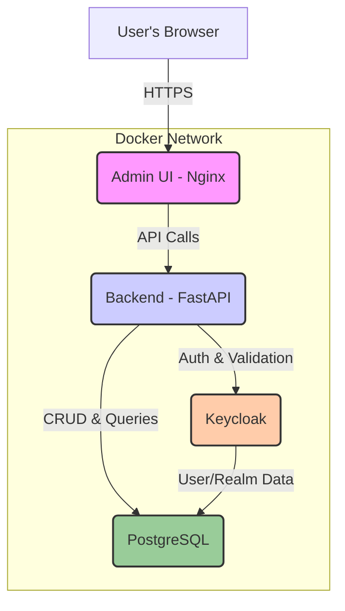

# EDI Lens Validator

EDI Lens is a full-stack web application designed for validating and managing Electronic Data Interchange (EDI) files. It features a modern, multi-tenant architecture with a powerful backend API and a responsive administrative user interface.

## Key Features

-   **Multi-Tenant Architecture**: Securely isolates data and configurations for different clients using Keycloak groups.
-   **Role-Based Access Control (RBAC)**: Fine-grained permissions for users, managed centrally in Keycloak.
-   **Automated Audit Logging**: Captures all `CREATE`, `UPDATE`, and `DELETE` operations on the database for compliance and traceability.
-   **Rich Admin UI**: A modern interface built with Refine.js and Ant Design for managing trading partners and configurations.
-   **Asynchronous Backend**: High-performance API built with Python, FastAPI, and SQLAlchemy 2.0.

---

## Architecture

The application is composed of several containerized services managed by Docker Compose:


```mermaid
graph TD
    A[User's Browser] -->|HTTPS| B(Admin UI - Nginx);
    B -->|API Calls| C(Backend - FastAPI);
    C -->|Auth & Validation| E(Keycloak);
    C -->|CRUD & Queries| D(PostgreSQL);
    E -->|User/Realm Data| D;

    subgraph "Docker Network"
        B; C; D; E;
    end

    style B fill:#f9f,stroke:#333,stroke-width:2px
    style C fill:#ccf,stroke:#333,stroke-width:2px
    style D fill:#9c9,stroke:#333,stroke-width:2px
    style E fill:#fca,stroke:#333,stroke-width:2px
```

---

## Technology Stack

| Area      | Technology                                                                                                    |
| :-------- | :------------------------------------------------------------------------------------------------------------ |
| **Backend** | [Python](https://www.python.org/), [FastAPI](https://fastapi.tiangolo.com/), [SQLAlchemy](https://www.sqlalchemy.org/), [Alembic](https://alembic.sqlalchemy.org/), [Pydantic](https://pydantic-docs.helpmanual.io/) |
| **Frontend**  | [TypeScript](https://www.typescriptlang.org/), [React](https://reactjs.org/), [Refine.js](https://refine.dev/), [Ant Design](https://ant.design/), [Vite](https://vitejs.dev/)   |
| **Database**  | [PostgreSQL](https://www.postgresql.org/)                                                                     |
| **Auth**      | [Keycloak](https://www.keycloak.org/) (Handles authentication, roles, and tenant groups)                      |
| **DevOps**    | [Docker](https://www.docker.com/) & [Docker Compose](https://docs.docker.com/compose/)                          |

---

## Prerequisites

-   [Docker](https://docs.docker.com/get-docker/) and [Docker Compose](https://docs.docker.com/compose/install/)
-   A `.env` file in the project root (see `.env.example`)

---

## 🚀 Quick Start

1.  **Clone the repository:**
    ```bash
    git clone https://github.com/kreddys/edi-lens.git
    cd edi-lens
    ```

2.  **Create your environment file:**
    Copy the example file and fill in your desired passwords.
    ```bash
    cp .env.example .env
    ```

3.  **Run the one-time Keycloak setup:**
    This script starts all services and configures the Keycloak realm, clients, roles, and users.
    ```bash
    ./scripts/run_app.sh setup:keycloak
    ```
    *This command can be safely re-run at any time.*

4.  **Start the development environment:**
    This starts all services with live-reloading enabled for the backend.
    ```bash
    ./scripts/run_app.sh dev
    ```

5.  **Access the Application:**
    -   **Admin UI**: [http://localhost:3000](http://localhost:3000)
    -   **Keycloak Admin**: [http://localhost:8080](http://localhost:8080)
    -   **Backend API Docs**: [http://localhost:8000/docs](http://localhost:8000/docs)

    **Default Login Credentials:**
    -   **Superuser**: `superuser@edilens.com` / `password`
    -   **Tenant A Admin**: `admin.a@edilens.com` / `password`
    -   **Tenant B Viewer**: `viewer.b@edilens.com` / `password`

---

## Development Scripts

All common development tasks are managed via the `./scripts/run_app.sh` script.

| Command                                      | Description                                                                 |
| :------------------------------------------- | :-------------------------------------------------------------------------- |
| `./scripts/run_app.sh dev`                   | Starts all services in development mode with backend hot-reloading.         |
| `./scripts/run_app.sh down`                  | Stops and removes all running services.                                     |
| `./scripts/run_app.sh clean`                 | **DANGEROUS**. Stops services and deletes all database data and volumes.      |
| `./scripts/run_app.sh logs`                  | Tails the logs for all running services.                                    |
| `./scripts/run_app.sh migrate:make "message"` | Generates a new Alembic database migration file.                            |
| `./scripts/run_app.sh migrate:run`           | Applies all pending database migrations.                                    |
| `./scripts/run_app.sh test:backend`          | Runs all non-integration tests for the backend.                             |
| `./scripts/run_app.sh test:integration`      | Runs integration tests that require live Keycloak and database services.    |
| `./scripts/run_app.sh setup:keycloak`        | (Re)configures the Keycloak realm with required settings.                   |

---

## Project Structure

```
.
├── admin-ui/           # Frontend React application (Refine.js, Ant Design)
├── backend/            # Backend Python application (FastAPI, SQLAlchemy)
├── postgres-data/      # (Git-ignored) Persistent PostgreSQL data
├── scripts/            # Helper scripts for development (run_app.sh)
├── .env.example        # Example environment variables
├── docker-compose.yml  # Main service definitions for production/CI
└── README.md           # This file
```

## 📚 Documentation

This project contains several layers of documentation to aid developers and users.

-   **User Guide**: Explains the core application logic, such as how to configure Trading Partners. See the [`docs/user_guide.md`](./docs/user_guide.md) for details.

-   **API Documentation**: Once the application is running, a full, interactive OpenAPI (Swagger UI) is available at [http://localhost:8000/docs](http://localhost:8000/docs). This documentation is automatically generated from the backend code.

-   **Keycloak Setup Guide**: Our specific configuration for Keycloak, including the RBAC and multi-tenancy model, is detailed in the [`docs/keycloak_setup_guide.md`](./docs/keycloak_setup_guide.md) file.

-   **Architectural Decision Records (ADRs)**: Key architectural decisions are documented in the [`docs/adr`](./docs/adr) directory. These records explain *why* certain technical choices were made.

-   **Service-Specific READMEs**: Each service (`backend/`, `admin-ui/`) has its own `README.md` file with details about its specific technology stack and development practices.