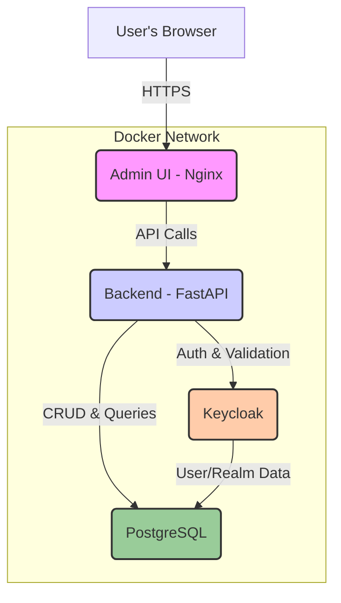

# EDI Lens Architecture

## Overview

This document provides a comprehensive overview of the EDI Lens application architecture, from the high-level service interactions down to the backend's internal structure.

## High-Level Architecture

The application is composed of several containerized services managed by Docker Compose. The main components are a frontend single-page application, a backend REST API, a PostgreSQL database for data persistence, and Keycloak for authentication and authorization.



## Technology Stack

| Area      | Technology                                                                                                    |
| :-------- | :------------------------------------------------------------------------------------------------------------ |
| **Backend** | [Python](https://www.python.org/), [FastAPI](https://fastapi.tiangolo.com/), [SQLAlchemy](https://www.sqlalchemy.org/), [Alembic](https://alembic.sqlalchemy.org/), [Pydantic](https://pydantic-docs.helpmanual.io/) |
| **Frontend**  | [TypeScript](https://www.typescriptlang.org/), [React](https://reactjs.org/), [Refine.js](https://refine.dev/), [Ant Design](https://ant.design/), [Vite](https://vitejs.dev/)   |
| **Database**  | [PostgreSQL](https://www.postgresql.org/)                                                                     |
| **Auth**      | [Keycloak](https://www.keycloak.org/) (Handles authentication, roles, and tenant groups)                      |
| **DevOps**    | [Docker](https://www.docker.com/) & [Docker Compose](https://docs.docker.com/compose/)                          |

## Backend Architecture

The backend is a monolithic FastAPI application written in Python. The source code in the `src` directory is organized for clarity and maintainability, separating concerns into distinct layers.

### Backend Directory Structure

```
src/
├── api/                    # FastAPI endpoints and request/response schemas
│   ├── endpoints/          # API route definitions
│   │   ├── auth.py        # Authentication endpoints
│   │   ├── edi.py         # Consolidated EDI processing endpoints
│   │   └── schemas.py     # Schema management endpoints
│   └── schemas.py         # Pydantic models for API validation
├── core/                  # Core business logic and utilities
│   ├── acknowledgements/  # TA1 generation logic
│   ├── audit.py          # Audit logging system
│   ├── auth.py           # Authentication and authorization
│   ├── config.py         # Application configuration
│   ├── database.py       # Database connectivity
│   ├── edi_parser.py     # EDI parsing engine
│   ├── schema_manager.py # EDI schema management
│   └── storage.py        # File storage abstraction
├── models/               # SQLAlchemy ORM models
│   ├── audit_log.py     # Audit trail model
│   ├── processing_log.py # Processing history model
│   └── validation_transaction.py # Transaction tracking model
├── services/             # Business logic services
│   ├── batch_job_service.py     # Batch processing
│   ├── edi_parsing_service.py   # EDI parsing service
│   ├── edi_validation_service.py # EDI validation service
│   └── ta1_generation_service.py # TA1 acknowledgment service
└── main.py              # FastAPI application entrypoint
```

### Layer Descriptions

-   **`api/`**: This layer is responsible for handling HTTP requests. It contains the FastAPI routers and Pydantic schemas that define the shape of the API requests and responses. It is the entry point for all external communication.
-   **`services/`**: This layer contains the core business logic of the application. It orchestrates calls to the `core` and `models` layers to fulfill the requests coming from the `api` layer.
-   **`core/`**: This layer contains foundational, reusable components and utilities that are used across the application. This includes things like the database connection setup, authentication logic, and the main EDI parsing engine.
-   **`models/`**: This layer defines the application's data structure using SQLAlchemy ORM models. Each file corresponds to a table in the database.
-   **`main.py`**: This is the main entry point that initializes and configures the FastAPI application.
