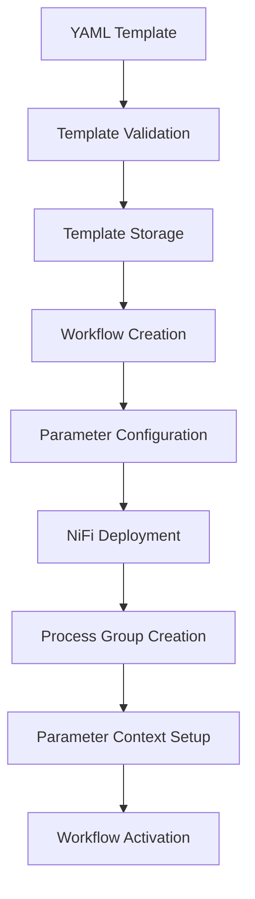
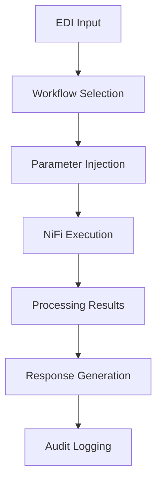

# NiFi Workflows - Architecture & Implementation

*Comprehensive technical architecture and implementation details for the NiFi workflow system*

## 🏗️ **System Architecture**

### **Overview**
EDI Lens implements a template-driven workflow architecture powered by Apache NiFi, separating concerns between backend EDI APIs and workflow orchestration. This architecture provides flexibility, scalability, and reusability for both batch and real-time EDI processing.

### **Core Requirements**

#### **1. Workflow Management**
- **Template-Driven**: All workflows based on predefined, configurable templates
- **Multi-Tenant**: Complete separation of tenant data and workflows
- **Category-Based**: Support for BATCH, REALTIME, and TRANSFORMATION workflows
- **Version Control**: Template versioning for evolution and rollback
- **Configuration Validation**: Schema validation for workflow setup

#### **2. Processing Models**
- **Batch Processing**: SFTP file monitoring with asynchronous processing
- **Real-time Processing**: HTTP endpoints with synchronous responses
- **Transformation**: Format conversion (JSON/CSV/XML ↔ EDI)

#### **3. NiFi Integration**
- **Registry Integration**: Templates stored in NiFi Registry for versioned flows
- **Process Group Management**: Workflow instances as NiFi process groups
- **Parameter Contexts**: Workflow-specific configuration management
- **State Control**: Start, stop, restart deployed workflows
- **Monitoring**: Real-time status and health checks

## 🔧 **Core Components**

### **Backend Services**

#### **NiFi API Clients**
```python
# Core NiFi integration components
nifi_client/
├── registry_client.py      # NiFi Registry API client
├── core_client.py         # NiFi Core API client  
├── process_groups.py      # Process group management
├── parameter_contexts.py  # Configuration management
└── templates.py          # Template operations
```

**Key Features:**
- **Full API Coverage**: All required NiFi operations
- **Error Handling**: Robust retry logic and failure recovery
- **Authentication**: Bearer token and certificate support
- **Performance**: Connection pooling and caching

#### **Workflow Service**
```python
# Workflow orchestration service
workflow_service/
├── workflow_manager.py    # Core workflow operations
├── template_loader.py     # YAML template processing
├── deployment_service.py  # NiFi deployment management
└── status_monitor.py     # Real-time status tracking
```

**Capabilities:**
- **Template Management**: Load, validate, and deploy templates
- **Workflow Lifecycle**: Create, deploy, start, stop, delete
- **Configuration**: Dynamic parameter injection
- **Monitoring**: Health checks and status reporting

#### **Database Models**
```python
# Data persistence layer
models/
├── workflow_template.py   # Template definitions
├── workflow.py           # Workflow instances
├── deployment.py         # Deployment tracking
└── execution_history.py  # Execution logs
```

**Schema Features:**
- **Multi-tenant Isolation**: Tenant-scoped data access
- **Audit Trail**: Complete change tracking
- **Configuration Storage**: JSON schema validation
- **Performance Optimization**: Indexed queries

### **API Endpoints**

#### **Workflow Templates**
```
GET    /api/v1/workflow-templates          # List templates
GET    /api/v1/workflow-templates/{id}     # Get template details
POST   /api/v1/workflow-templates          # Create template
PUT    /api/v1/workflow-templates/{id}     # Update template
DELETE /api/v1/workflow-templates/{id}     # Delete template
```

#### **Workflows**
```
GET    /api/v1/workflows                   # List workflows (tenant-filtered)
GET    /api/v1/workflows/{id}              # Get workflow details
POST   /api/v1/workflows                   # Create workflow
PUT    /api/v1/workflows/{id}              # Update workflow
DELETE /api/v1/workflows/{id}              # Delete workflow
POST   /api/v1/workflows/{id}/deploy       # Deploy to NiFi
POST   /api/v1/workflows/{id}/undeploy     # Remove from NiFi
POST   /api/v1/workflows/{id}/start        # Start workflow
POST   /api/v1/workflows/{id}/stop         # Stop workflow
GET    /api/v1/workflows/{id}/status       # Get real-time status
POST   /api/v1/workflows/{id}/process      # Execute workflow
```

## 🔐 **Security Architecture**

### **Authentication & Authorization**
- **JWT Integration**: Keycloak-based authentication
- **Role-Based Access**: Admin, User, ReadOnly roles
- **Tenant Isolation**: Complete data segregation
- **API Security**: Bearer token validation

### **Multi-Tenant Design**
```python
# Tenant isolation implementation
class TenantMixin:
    tenant_id = Column(String, nullable=False, index=True)
    
    @classmethod
    def by_tenant(cls, tenant_id):
        return cls.query.filter(cls.tenant_id == tenant_id)
```

## 📊 **Data Flow Architecture**

### **Template to Workflow Flow**


### **EDI Processing Flow**


## 🛠️ **Implementation Details**

### **Template System**

#### **YAML Template Structure**
```yaml
# Example workflow template
apiVersion: edi-lens/v1
kind: WorkflowTemplate
metadata:
  name: batch-edi-processor
  category: BATCH
  scope: TENANT
spec:
  description: "Batch EDI file processing with SFTP monitoring"
  parameters:
    required:
      - sftp_host
      - sftp_username
      - input_directory
    optional:
      - output_format
      - retry_count
  configuration_schema:
    type: object
    properties:
      sftp_host:
        type: string
        description: "SFTP server hostname"
      input_directory:
        type: string
        description: "Directory to monitor for files"
  nifi_template:
    file_path: "templates/batch-edi-processor.xml"
    process_group_name: "BatchEDIProcessor"
```

#### **Template Loading Process**
```python
# Template loading implementation
class TemplateLoader:
    def load_template(self, yaml_path: str) -> WorkflowTemplate:
        # 1. Load and validate YAML
        with open(yaml_path) as f:
            template_data = yaml.safe_load(f)
        
        # 2. Schema validation
        self.validate_template_schema(template_data)
        
        # 3. Load NiFi template
        nifi_template = self.load_nifi_template(
            template_data['spec']['nifi_template']['file_path']
        )
        
        # 4. Create database record
        return self.create_template_record(template_data, nifi_template)
```

### **NiFi Integration**

#### **Process Group Management**
```python
# Process group deployment
class ProcessGroupManager:
    async def deploy_workflow(self, workflow: Workflow) -> str:
        # 1. Create parameter context
        param_context_id = await self.create_parameter_context(
            workflow.name, workflow.configuration
        )
        
        # 2. Upload template to NiFi
        template_id = await self.upload_template(workflow.template.nifi_template)
        
        # 3. Instantiate template as process group
        process_group_id = await self.instantiate_template(
            template_id, workflow.name, param_context_id
        )
        
        # 4. Configure and start
        await self.configure_process_group(process_group_id, workflow.configuration)
        
        return process_group_id
```

#### **Status Monitoring**
```python
# Real-time status tracking
class StatusMonitor:
    async def get_workflow_status(self, workflow_id: str) -> WorkflowStatus:
        # 1. Get NiFi process group status
        pg_status = await self.nifi_client.get_process_group_status(workflow_id)
        
        # 2. Get execution metrics
        metrics = await self.get_execution_metrics(workflow_id)
        
        # 3. Health check
        health = await self.perform_health_check(workflow_id)
        
        return WorkflowStatus(
            status=pg_status.run_status,
            active_threads=pg_status.active_thread_count,
            flow_files_queued=pg_status.queued_count,
            execution_count=metrics.execution_count,
            health_status=health.status
        )
```

## 🔄 **Workflow Lifecycle**

### **Deployment Process**
1. **Template Selection**: User selects from available templates
2. **Configuration**: Required and optional parameters provided
3. **Validation**: Configuration validated against template schema
4. **NiFi Deployment**: Process group created in NiFi
5. **Parameter Setup**: Parameter context configured
6. **Activation**: Workflow started and monitored

### **Execution Process**
1. **Input Reception**: EDI content received via API
2. **Workflow Triggering**: Appropriate workflow selected
3. **Parameter Injection**: Dynamic configuration applied
4. **NiFi Processing**: Content processed through workflow
5. **Result Collection**: Processing results gathered
6. **Response Generation**: Formatted response returned

### **State Management**
```python
# Workflow state transitions
class WorkflowState(Enum):
    CREATED = "CREATED"           # Initial state
    DEPLOYING = "DEPLOYING"       # Deployment in progress
    DEPLOYED = "DEPLOYED"         # Deployed to NiFi
    RUNNING = "RUNNING"           # Active processing
    STOPPED = "STOPPED"           # Stopped but deployed
    ERROR = "ERROR"              # Error state
    DELETED = "DELETED"          # Soft deleted
```

## 🚀 **Performance Optimizations**

### **Caching Strategy**
- **Template Caching**: In-memory template storage
- **NiFi Client Pooling**: Connection reuse
- **Configuration Caching**: Parameter context caching
- **Status Caching**: Real-time status updates

### **Scalability Features**
- **Async Operations**: Non-blocking NiFi interactions
- **Batch Processing**: Multiple workflow operations
- **Load Balancing**: NiFi cluster support
- **Database Optimization**: Query optimization and indexing

## 🔧 **Development Setup**

### **Local Development**
```bash
# Start NiFi services
./run.sh dev:start:nifi

# Initialize templates
./run.sh dev:init:templates

# Run development server
./run.sh dev:start
```

### **Configuration**
```yaml
# config/nifi.yml
nifi:
  api_url: "http://localhost:8443/nifi-api"
  registry_url: "http://localhost:18080/nifi-registry-api"
  username: "admin"
  password: "ctsBtRBKHRAx69EqUghvvgEvjnaLjFEB"
  verify_ssl: false
  
workflow_templates:
  directory: "workflow_templates/"
  auto_load: true
  watch_changes: true
```

## 📚 **API Reference**

### **Request/Response Examples**

#### **Create Workflow**
```bash
POST /api/v1/workflows
Content-Type: application/json
Authorization: Bearer <jwt-token>
X-Tenant-ID: tenant-a

{
  "name": "Customer EDI Processor",
  "description": "Process customer EDI files",
  "template_id": "batch-edi-processor",
  "configuration": {
    "sftp_host": "sftp.customer.com",
    "sftp_username": "edi_user",
    "input_directory": "/incoming/edi",
    "output_format": "JSON"
  },
  "tags": ["customer", "batch"]
}
```

#### **Execute Workflow**
```bash
POST /api/v1/workflows/{workflow_id}/process
Content-Type: application/json
Authorization: Bearer <jwt-token>
X-Tenant-ID: tenant-a

{
  "edi_content": "ISA*00*          *00*          *ZZ*SENDER...",
  "processing_options": {
    "generate_ta1": true,
    "generate_999": true,
    "output_format": "JSON"
  }
}
```

## 🎯 **Best Practices**

### **Template Development**
- **Parameterization**: Make templates highly configurable
- **Error Handling**: Include robust error processing
- **Monitoring**: Add health check capabilities
- **Documentation**: Comprehensive parameter documentation

### **Workflow Management**
- **Naming Conventions**: Clear, descriptive workflow names
- **Configuration Validation**: Always validate input parameters
- **Resource Management**: Monitor NiFi resource usage
- **Cleanup**: Regular cleanup of unused workflows

### **Security**
- **Parameter Encryption**: Encrypt sensitive configuration
- **Access Control**: Implement proper role-based access
- **Audit Logging**: Log all workflow operations
- **Network Security**: Secure NiFi communication

---

This architecture provides a robust, scalable foundation for EDI workflow management while maintaining clear separation of concerns and supporting multi-tenant operations.