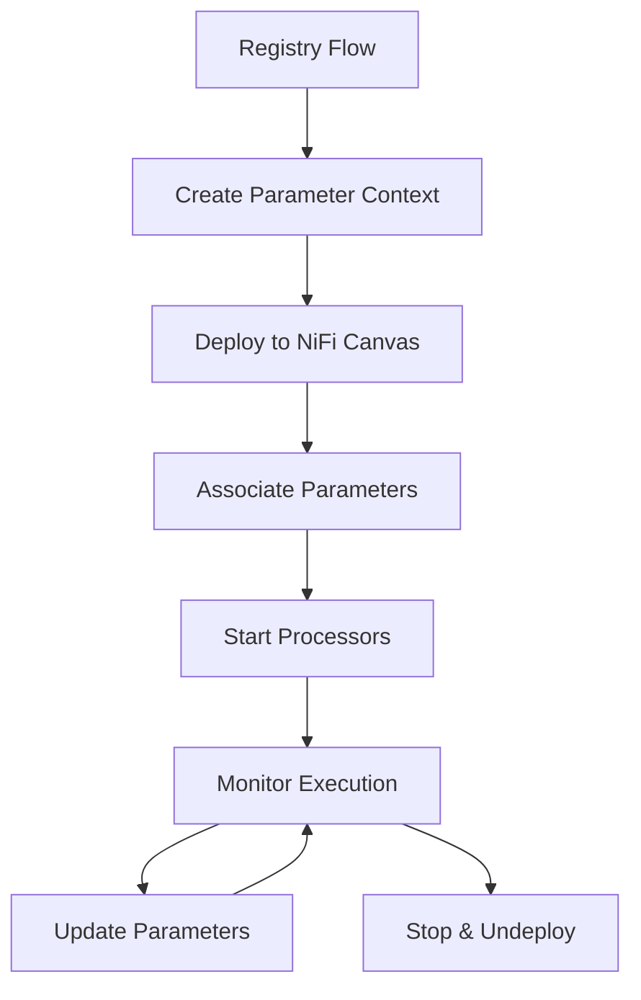

# Registry-First Flow Management Architecture

## 🎯 **Vision**

A clean, database-free approach to NiFi flow management that leverages NiFi Registry as the single source of truth and uses native NiFi Parameter Contexts for runtime configuration. This eliminates the complexity of local database storage while providing powerful versioning, parameterization, and deployment capabilities.

## 🏗 **Core Principles**

### **1. Registry-First Storage**
- All flow definitions stored in NiFi Registry (not local database)
- Registry provides native versioning and flow evolution tracking
- Single source of truth for all flow metadata

### **2. Native Parameter Context Integration**
- Use NiFi's Parameter Contexts for runtime configuration
- Live parameter updates without flow redeployment
- Clean separation of flow logic and configuration

### **3. Stateless Backend**
- No persistent storage of flow state in EDI-Lens
- Runtime deployment state maintained in memory only
- All persistent data lives in NiFi Registry + NiFi Canvas

### **4. Clean API Surface**
- Simple REST endpoints focused on operations, not CRUD
- Clear separation between Registry operations and NiFi deployment
- Intuitive lifecycle management

## 📋 **Architecture Overview**

### **Single "Flow" Concept**
```python
class Flow:
    """Represents a versioned flow in NiFi Registry"""
    
    # Registry identifiers (persistent)
    bucket_id: str
    flow_id: str
    version: int = 1
    
    # Runtime deployment state (ephemeral)
    process_group_id: Optional[str] = None
    parameter_context_id: Optional[str] = None
    deployment_status: str = "NOT_DEPLOYED"  # NOT_DEPLOYED, DEPLOYED, RUNNING, STOPPED
```

### **Core Services**

#### **FlowService**
```python
class FlowService:
    """Manages flows using Registry + NiFi APIs directly"""
    
    # Registry Operations
    async def create_flow(self, bucket_id: str, flow_definition: dict, parameters: dict) -> str
    async def get_flow(self, bucket_id: str, flow_id: str, version: int = None) -> dict
    async def update_flow(self, bucket_id: str, flow_id: str, flow_definition: dict) -> int
    async def list_flows(self, bucket_id: str) -> list[dict]
    async def delete_flow(self, bucket_id: str, flow_id: str) -> bool
    
    # NiFi Deployment Operations
    async def deploy_flow(self, bucket_id: str, flow_id: str, parameters: dict) -> str
    async def start_flow(self, process_group_id: str) -> bool
    async def stop_flow(self, process_group_id: str) -> bool
    async def undeploy_flow(self, process_group_id: str) -> bool
    
    # Status and Monitoring
    async def get_flow_status(self, process_group_id: str) -> dict
    async def get_deployment_info(self, bucket_id: str, flow_id: str) -> dict
```

#### **ParameterContextService**
```python
class ParameterContextService:
    """Manages parameterized flows with NiFi Parameter Contexts"""
    
    async def create_parameter_context(self, name: str, parameters: dict) -> str
    async def update_parameters(self, context_id: str, parameters: dict) -> bool
    async def get_parameters(self, context_id: str) -> dict
    async def apply_to_process_group(self, context_id: str, pg_id: str) -> bool
    async def delete_parameter_context(self, context_id: str) -> bool
```

## 🔄 **Complete Flow Lifecycle**

### **1. Flow Creation & Versioning**


### **2. Deployment & Runtime**


## 🚀 **API Design**

### **Registry Operations**
```bash
# Flow CRUD in Registry
POST   /api/flows/                           # Create new flow
GET    /api/flows/{bucket}/{flow}            # Get flow (latest version)
GET    /api/flows/{bucket}/{flow}/v/{version} # Get specific version
PUT    /api/flows/{bucket}/{flow}            # Update flow (creates new version)
DELETE /api/flows/{bucket}/{flow}            # Delete flow
GET    /api/flows/{bucket}                   # List flows in bucket
```

### **Deployment Operations**
```bash
# NiFi Canvas Management
POST   /api/flows/{bucket}/{flow}/deploy     # Deploy flow to NiFi
DELETE /api/flows/{bucket}/{flow}/deploy     # Undeploy from NiFi
POST   /api/flows/{bucket}/{flow}/start      # Start flow processors
POST   /api/flows/{bucket}/{flow}/stop       # Stop flow processors
GET    /api/flows/{bucket}/{flow}/status     # Get deployment status
```

### **Parameter Management**
```bash
# Runtime Configuration
PUT    /api/flows/{bucket}/{flow}/parameters # Update flow parameters
GET    /api/flows/{bucket}/{flow}/parameters # Get current parameters
POST   /api/flows/{bucket}/{flow}/restart    # Restart with new parameters
```

### **Bucket Management**
```bash
# Registry Bucket Operations
GET    /api/buckets/                         # List available buckets
POST   /api/buckets/                         # Create bucket
GET    /api/buckets/{bucket}/flows           # List flows in bucket
```

## 📊 **Example Usage Scenarios**

### **Scenario 1: Create and Deploy EDI Processing Flow**

#### **1. Create Flow Definition**
```python
flow_definition = {
    "name": "EDI File Processing",
    "description": "Process EDI files through validation and parsing",
    "processors": [
        {
            "id": "getfile-1",
            "name": "Get EDI Files", 
            "type": "org.apache.nifi.processors.standard.GetFile",
            "properties": {
                "Input Directory": "#{input_directory}",
                "File Filter": "#{file_pattern}",
                "Keep Source File": "false"
            }
        },
        {
            "id": "validate-1",
            "name": "Validate EDI",
            "type": "EDIValidationProcessor", 
            "properties": {
                "Validation Schema": "#{schema_file}",
                "Tenant ID": "#{tenant_id}"
            }
        },
        {
            "id": "putfile-success",
            "name": "Output Valid Files",
            "type": "org.apache.nifi.processors.standard.PutFile",
            "properties": {
                "Directory": "#{success_directory}"
            }
        }
    ],
    "connections": [
        {
            "source": "getfile-1",
            "destination": "validate-1", 
            "relationships": ["success"]
        },
        {
            "source": "validate-1",
            "destination": "putfile-success",
            "relationships": ["success"] 
        }
    ]
}

parameters = {
    "input_directory": "/tmp/edi-input",
    "file_pattern": "*.edi",
    "schema_file": "837.5010.X222.A1.json",
    "tenant_id": "tenant-a",
    "success_directory": "/tmp/edi-success"
}
```

#### **2. Create and Deploy**
```python
# Create flow in Registry
flow_id = await flow_service.create_flow(
    bucket_id="edi-processing",
    flow_definition=flow_definition,
    parameters=parameters
)

# Deploy to NiFi
process_group_id = await flow_service.deploy_flow(
    bucket_id="edi-processing",
    flow_id=flow_id,
    parameters=parameters
)

# Start processing
await flow_service.start_flow(process_group_id)
```

#### **3. Runtime Parameter Updates**
```python
# Update parameters without redeployment
new_parameters = {
    "input_directory": "/tmp/edi-batch-2",
    "tenant_id": "tenant-b"
}

await parameter_service.update_parameters(
    context_id=parameter_context_id,
    parameters=new_parameters
)
```

### **Scenario 2: E2E Test Implementation**
```python
async def test_file_processing_flow():
    """E2E test using Registry-first flow management"""
    
    # Setup test environment
    test_id = uuid.uuid4().hex[:8]
    test_dirs = create_test_directories(test_id)
    
    # Create simple processing flow
    flow_def = create_file_processing_flow_definition(test_dirs)
    
    # Deploy and test
    flow_id = await flow_service.create_flow("test-bucket", flow_def, test_parameters)
    pg_id = await flow_service.deploy_flow("test-bucket", flow_id, test_parameters)
    
    # Execute test
    await flow_service.start_flow(pg_id)
    create_test_input_file(test_dirs["input"])
    
    # Validate processing
    await validate_file_processing_results(test_dirs["output"])
    
    # Cleanup
    await flow_service.stop_flow(pg_id)
    await flow_service.undeploy_flow(pg_id)
```

## 💡 **Key Advantages**

### **1. Zero Database Dependencies**
- ✅ No local models for templates/workflows
- ✅ No database migrations for flow changes
- ✅ Registry provides all persistence needs
- ✅ Simplified deployment and backup

### **2. True Version Control**
- ✅ Native Registry versioning
- ✅ Flow evolution tracking
- ✅ Easy rollback to previous versions
- ✅ Diff capabilities between versions

### **3. Native NiFi Integration**
- ✅ Parameter Contexts for runtime config
- ✅ Live parameter updates
- ✅ Standard NiFi deployment patterns
- ✅ Full NiFi UI compatibility

### **4. Clean Architecture**
- ✅ Stateless backend service
- ✅ Clear separation of concerns
- ✅ Simple REST API surface
- ✅ Easy to test and maintain

### **5. Production Ready**
- ✅ Leverages NiFi's battle-tested features
- ✅ Scales with NiFi's capabilities
- ✅ Standard operational patterns
- ✅ Full monitoring integration

## 🔧 **Implementation Components**

### **Enhanced Clients**
```python
# backend/src/clients/nifi_client.py
# Add parameter context operations:
# - create_parameter_context()
# - update_parameter_context()
# - get_parameter_context()
# - apply_parameter_context_to_process_group()

# backend/src/clients/registry_client.py  
# Add flow management operations:
# - create_flow()
# - update_flow()
# - get_flow_version()
# - import_flow_to_nifi()
```

### **Core Services**
```python
# backend/src/services/flow_service.py
# Main flow lifecycle management

# backend/src/services/parameter_context_service.py
# Parameter management

# backend/src/services/bucket_service.py
# Registry bucket operations
```

### **API Routes**
```python
# backend/src/api/routes/flows.py
# RESTful flow management endpoints

# backend/src/api/routes/buckets.py
# Registry bucket management
```

### **E2E Testing**
```python
# backend/tests/e2e/flows/test_file_processing.py
# Complete E2E test using Registry flows

# docker/docker-compose.yml
# Add shared volumes for file processing tests
```

## 📈 **Future Enhancements**

### **Phase 2: Advanced Features**
- **Flow Templates**: Reusable flow patterns
- **Environment Promotion**: Dev → Staging → Prod flow promotion
- **Advanced Monitoring**: Flow execution metrics and alerting
- **Flow Validation**: Pre-deployment validation and testing

### **Phase 3: Enterprise Features**
- **Multi-tenancy**: Tenant-specific buckets and flows
- **RBAC Integration**: Fine-grained access control
- **Audit Logging**: Complete flow lifecycle auditing
- **Advanced Scheduling**: Time-based and event-driven flow execution

## 🛡 **Comprehensive Validation & Error Handling**

### **Validation Strategy Overview**

The Registry-First Flow Management system implements multi-layered validation to provide clear, actionable error messages at every stage of the flow lifecycle. Each validation layer catches specific types of issues and provides detailed feedback for resolution.

#### **Validation Layers**

1. **Pre-Upload Validation** (Client-side + API)
2. **Registry Upload Validation** (Registry API responses)
3. **Pre-Deployment Validation** (NiFi compatibility)
4. **Deployment Validation** (NiFi Canvas operations)
5. **Runtime Validation** (Process group lifecycle)

### **1. Pre-Upload Flow Validation**

#### **Flow Definition Structure Validation**
```python
class FlowValidator:
    """Validates flow definitions before Registry upload"""
    
    async def validate_flow_definition(self, flow_def: dict) -> ValidationResult:
        """Comprehensive pre-upload validation"""
        
        errors = []
        warnings = []
        
        # Structure validation
        structure_errors = self._validate_structure(flow_def)
        
        # Processor validation
        processor_errors = self._validate_processors(flow_def.get("processors", []))
        
        # Connection validation  
        connection_errors = self._validate_connections(flow_def.get("connections", []))
        
        # Parameter validation
        parameter_errors = self._validate_parameters(flow_def.get("parameters", []))
        
        # Bundle availability validation
        bundle_errors = await self._validate_bundles(flow_def)
        
        return ValidationResult(
            valid=len(errors) == 0,
            errors=errors,
            warnings=warnings,
            validation_details={
                "structure": structure_errors,
                "processors": processor_errors,
                "connections": connection_errors, 
                "parameters": parameter_errors,
                "bundles": bundle_errors
            }
        )
```

#### **Parameter Context Validation**
```python
async def validate_parameter_context(self, parameters: dict) -> ValidationResult:
    """Validate parameter definitions and values"""
    
    validation_issues = []
    
    for param_name, param_value in parameters.items():
        # Parameter name validation
        if not re.match(r'^[a-zA-Z0-9_-]+$', param_name):
            validation_issues.append({
                "type": "INVALID_PARAMETER_NAME",
                "parameter": param_name,
                "message": f"Parameter name '{param_name}' contains invalid characters",
                "fix": "Use only letters, numbers, underscores, and hyphens"
            })
        
        # Parameter value validation
        if param_value is None or param_value == "":
            validation_issues.append({
                "type": "EMPTY_PARAMETER_VALUE", 
                "parameter": param_name,
                "message": f"Parameter '{param_name}' has empty value",
                "fix": "Provide a valid value for this parameter"
            })
    
    return ValidationResult(valid=len(validation_issues) == 0, issues=validation_issues)
```

### **2. Registry Upload Error Handling**

#### **Registry API Error Response Mapping**
```python
class RegistryErrorHandler:
    """Handles Registry API errors with detailed user feedback"""
    
    ERROR_MAPPINGS = {
        400: {
            "type": "INVALID_FLOW_DEFINITION",
            "user_message": "Flow definition is invalid",
            "action": "Review flow structure and fix validation errors"
        },
        401: {
            "type": "AUTHENTICATION_FAILED", 
            "user_message": "Authentication with Registry failed",
            "action": "Check Registry credentials and connection"
        },
        403: {
            "type": "AUTHORIZATION_FAILED",
            "user_message": "Not authorized to create flows in this bucket", 
            "action": "Check bucket permissions or contact administrator"
        },
        409: {
            "type": "FLOW_ALREADY_EXISTS",
            "user_message": "Flow with this name already exists",
            "action": "Use a different flow name or update existing flow"
        },
        500: {
            "type": "REGISTRY_SERVER_ERROR",
            "user_message": "Registry server encountered an error",
            "action": "Check Registry server status and try again"
        }
    }
    
    async def handle_registry_error(self, response: aiohttp.ClientResponse) -> dict:
        """Convert Registry errors to actionable user feedback"""
        
        error_info = self.ERROR_MAPPINGS.get(response.status, {
            "type": "UNKNOWN_REGISTRY_ERROR",
            "user_message": f"Registry returned status {response.status}",
            "action": "Check Registry server logs for details"
        })
        
        # Parse Registry error response for additional details
        try:
            error_body = await response.json()
            registry_message = error_body.get("message", "")
            registry_details = error_body.get("details", [])
        except:
            registry_message = await response.text()
            registry_details = []
        
        return {
            "error_type": error_info["type"],
            "user_message": error_info["user_message"],
            "action_required": error_info["action"],
            "registry_message": registry_message,
            "registry_details": registry_details,
            "status_code": response.status,
            "endpoint": str(response.url)
        }
```

### **3. Pre-Deployment NiFi Validation**

#### **NiFi Compatibility Validation** 
```python
class NiFiCompatibilityValidator:
    """Validates flows against live NiFi instance before deployment"""
    
    async def validate_for_deployment(self, flow_def: dict, nifi_client: NiFiClient) -> ValidationResult:
        """Validate flow can be deployed to target NiFi"""
        
        validation_results = []
        
        # 1. Bundle availability validation
        bundle_validation = await self._validate_processor_bundles(flow_def, nifi_client)
        validation_results.append(bundle_validation)
        
        # 2. Controller service validation  
        cs_validation = await self._validate_controller_services(flow_def, nifi_client)
        validation_results.append(cs_validation)
        
        # 3. Resource availability validation
        resource_validation = await self._validate_resources(flow_def, nifi_client)
        validation_results.append(resource_validation)
        
        # 4. Parameter context compatibility
        param_validation = await self._validate_parameter_context_compatibility(flow_def, nifi_client)
        validation_results.append(param_validation)
        
        return self._consolidate_validation_results(validation_results)
    
    async def _validate_processor_bundles(self, flow_def: dict, nifi_client: NiFiClient) -> ValidationResult:
        """Validate all processor types are available in NiFi"""
        
        missing_bundles = []
        
        for processor in flow_def.get("processors", []):
            processor_type = processor.get("type")
            
            try:
                # Check if processor type is available
                await nifi_client.get_processor_type_info(processor_type)
            except Exception as e:
                missing_bundles.append({
                    "processor_name": processor.get("name"),
                    "processor_type": processor_type,
                    "error": str(e),
                    "fix": f"Install bundle containing '{processor_type}' or use alternative processor"
                })
        
        return ValidationResult(
            valid=len(missing_bundles) == 0,
            errors=missing_bundles
        )
```

### **4. NiFi Deployment Error Handling**

#### **Process Group Deployment Validation**
```python
class DeploymentErrorHandler:
    """Handles NiFi deployment errors with detailed feedback"""
    
    async def deploy_with_validation(self, bucket_id: str, flow_id: str, parameters: dict) -> DeploymentResult:
        """Deploy flow with comprehensive error handling"""
        
        try:
            # 1. Create parameter context
            param_context_result = await self._create_parameter_context_with_validation(parameters)
            if not param_context_result.success:
                return DeploymentResult(
                    success=False,
                    error_type="PARAMETER_CONTEXT_CREATION_FAILED",
                    error_details=param_context_result.errors,
                    user_message="Failed to create parameter context",
                    action_required="Review parameter definitions and values"
                )
            
            # 2. Import flow from Registry
            import_result = await self._import_flow_with_validation(bucket_id, flow_id)
            if not import_result.success:
                return DeploymentResult(
                    success=False,
                    error_type="FLOW_IMPORT_FAILED", 
                    error_details=import_result.errors,
                    user_message="Failed to import flow from Registry",
                    action_required="Check flow definition and Registry connectivity"
                )
            
            # 3. Apply parameter context to process group
            param_apply_result = await self._apply_parameter_context_with_validation(
                import_result.process_group_id, 
                param_context_result.parameter_context_id
            )
            if not param_apply_result.success:
                return DeploymentResult(
                    success=False,
                    error_type="PARAMETER_APPLICATION_FAILED",
                    error_details=param_apply_result.errors,
                    user_message="Failed to apply parameters to flow",
                    action_required="Check parameter names match flow definition"
                )
            
            # 4. Validate deployment state
            validation_result = await self._validate_deployment_state(import_result.process_group_id)
            
            return DeploymentResult(
                success=True,
                process_group_id=import_result.process_group_id,
                parameter_context_id=param_context_result.parameter_context_id,
                validation_details=validation_result
            )
            
        except Exception as e:
            return DeploymentResult(
                success=False,
                error_type="DEPLOYMENT_EXCEPTION",
                error_details={"exception": str(e)},
                user_message="Unexpected error during deployment",
                action_required="Check NiFi server status and logs"
            )
```

### **5. Runtime Process Group Validation**

#### **Process Group Lifecycle Error Handling**
```python
class ProcessGroupLifecycleHandler:
    """Handles process group start/stop operations with validation"""
    
    async def start_process_group_with_validation(self, process_group_id: str) -> OperationResult:
        """Start process group with comprehensive validation"""
        
        # 1. Pre-start validation
        pre_start_validation = await self._validate_before_start(process_group_id)
        if not pre_start_validation.valid:
            return OperationResult(
                success=False,
                error_type="PRE_START_VALIDATION_FAILED",
                validation_errors=pre_start_validation.errors,
                user_message="Cannot start flow due to validation errors",
                action_required="Fix validation errors before starting"
            )
        
        # 2. Attempt to start processors
        start_results = []
        for processor_id in pre_start_validation.processor_ids:
            try:
                await self.nifi_client.start_processor(processor_id)
                start_results.append({"processor_id": processor_id, "status": "STARTED"})
            except Exception as e:
                start_results.append({
                    "processor_id": processor_id,
                    "status": "FAILED",
                    "error": str(e),
                    "fix": self._get_processor_start_fix_suggestion(e)
                })
        
        # 3. Post-start validation
        failed_starts = [r for r in start_results if r["status"] == "FAILED"]
        if failed_starts:
            return OperationResult(
                success=False,
                error_type="PROCESSOR_START_FAILED",
                processor_errors=failed_starts,
                user_message=f"{len(failed_starts)} processors failed to start",
                action_required="Review processor configurations and dependencies"
            )
        
        return OperationResult(
            success=True,
            processors_started=len(start_results),
            operation_details=start_results
        )
    
    def _get_processor_start_fix_suggestion(self, error: Exception) -> str:
        """Provide specific fix suggestions based on error type"""
        
        error_str = str(error).lower()
        
        if "invalid" in error_str and "property" in error_str:
            return "Check processor property values and parameter substitution"
        elif "controller service" in error_str:
            return "Ensure required controller services are enabled"
        elif "connection" in error_str:
            return "Verify processor connections and relationships"
        elif "validation" in error_str:
            return "Fix processor validation errors in configuration"
        else:
            return "Check processor configuration and NiFi logs for details"
```

### **6. Enhanced API Error Responses**

#### **Standardized Error Response Format**
```python
class APIErrorResponse:
    """Standardized error response format for all endpoints"""
    
    def __init__(
        self,
        error_type: str,
        user_message: str, 
        action_required: str,
        validation_errors: list = None,
        technical_details: dict = None
    ):
        self.error_type = error_type
        self.user_message = user_message
        self.action_required = action_required
        self.validation_errors = validation_errors or []
        self.technical_details = technical_details or {}
        self.timestamp = datetime.utcnow().isoformat()
    
    def to_dict(self) -> dict:
        return {
            "success": False,
            "error": {
                "type": self.error_type,
                "message": self.user_message,
                "action_required": self.action_required,
                "timestamp": self.timestamp
            },
            "validation_errors": self.validation_errors,
            "technical_details": self.technical_details
        }

# Example API responses
{
    "success": false,
    "error": {
        "type": "FLOW_VALIDATION_FAILED",
        "message": "Flow definition contains validation errors",
        "action_required": "Fix the validation errors listed below",
        "timestamp": "2023-12-01T10:30:00Z"
    },
    "validation_errors": [
        {
            "component_type": "processor",
            "component_name": "GetFile Processor", 
            "field": "Input Directory",
            "error": "Property value contains invalid characters",
            "fix": "Use only alphanumeric characters and standard path separators"
        },
        {
            "component_type": "connection",
            "component_name": "GetFile to ValidateEDI",
            "error": "Source processor 'GetFile' does not exist",
            "fix": "Ensure source processor ID matches existing processor"
        }
    ],
    "technical_details": {
        "validation_layer": "pre_upload",
        "failed_components": 2,
        "total_components": 5
    }
}
```

### **7. Enhanced Service Methods with Validation**

#### **FlowService with Comprehensive Error Handling**
```python
class FlowService:
    async def create_flow(
        self, 
        bucket_id: str, 
        flow_definition: dict, 
        parameters: dict
    ) -> FlowCreationResult:
        """Create flow with multi-layer validation"""
        
        # 1. Pre-upload validation
        validation_result = await self.validator.validate_flow_definition(flow_definition)
        if not validation_result.valid:
            return FlowCreationResult(
                success=False,
                error=APIErrorResponse(
                    error_type="FLOW_VALIDATION_FAILED",
                    user_message="Flow definition contains validation errors",
                    action_required="Fix validation errors and retry",
                    validation_errors=validation_result.errors
                )
            )
        
        # 2. Parameter validation
        param_validation = await self.validator.validate_parameter_context(parameters)
        if not param_validation.valid:
            return FlowCreationResult(
                success=False,
                error=APIErrorResponse(
                    error_type="PARAMETER_VALIDATION_FAILED",
                    user_message="Parameter definitions are invalid",
                    action_required="Fix parameter issues and retry",
                    validation_errors=param_validation.issues
                )
            )
        
        # 3. Registry upload with error handling
        try:
            flow_id = await self.registry_client.create_flow(bucket_id, flow_definition)
            return FlowCreationResult(success=True, flow_id=flow_id)
            
        except RegistryAPIError as e:
            error_response = await self.registry_error_handler.handle_registry_error(e.response)
            return FlowCreationResult(
                success=False,
                error=APIErrorResponse(
                    error_type=error_response["error_type"],
                    user_message=error_response["user_message"], 
                    action_required=error_response["action_required"],
                    technical_details=error_response
                )
            )
    
    async def deploy_flow(
        self,
        bucket_id: str,
        flow_id: str, 
        parameters: dict
    ) -> FlowDeploymentResult:
        """Deploy flow with comprehensive validation and error handling"""
        
        # 1. Pre-deployment NiFi validation
        nifi_validation = await self.nifi_validator.validate_for_deployment(flow_id, self.nifi_client)
        if not nifi_validation.valid:
            return FlowDeploymentResult(
                success=False,
                error=APIErrorResponse(
                    error_type="NIFI_COMPATIBILITY_FAILED",
                    user_message="Flow is not compatible with target NiFi instance",
                    action_required="Review compatibility issues and update flow",
                    validation_errors=nifi_validation.errors
                )
            )
        
        # 2. Deployment with detailed error handling
        deployment_result = await self.deployment_handler.deploy_with_validation(
            bucket_id, flow_id, parameters
        )
        
        if not deployment_result.success:
            return FlowDeploymentResult(
                success=False,
                error=APIErrorResponse(
                    error_type=deployment_result.error_type,
                    user_message=deployment_result.user_message,
                    action_required=deployment_result.action_required,
                    technical_details=deployment_result.error_details
                )
            )
        
        return FlowDeploymentResult(
            success=True,
            process_group_id=deployment_result.process_group_id,
            parameter_context_id=deployment_result.parameter_context_id,
            deployment_details=deployment_result.validation_details
        )
```

### **8. Validation Integration Points**

#### **API Endpoint Error Handling**
```python
@router.post("/flows/", response_model=FlowCreationResponse)
async def create_flow(request: CreateFlowRequest) -> FlowCreationResponse:
    """Create flow with comprehensive validation"""
    
    try:
        result = await flow_service.create_flow(
            bucket_id=request.bucket_id,
            flow_definition=request.flow_definition,
            parameters=request.parameters
        )
        
        if result.success:
            return FlowCreationResponse(
                success=True,
                flow_id=result.flow_id,
                message="Flow created successfully"
            )
        else:
            # Return detailed validation errors
            raise HTTPException(
                status_code=400,
                detail=result.error.to_dict()
            )
            
    except Exception as e:
        # Handle unexpected errors
        logger.exception("Unexpected error in create_flow")
        raise HTTPException(
            status_code=500,
            detail={
                "success": False,
                "error": {
                    "type": "INTERNAL_SERVER_ERROR",
                    "message": "An unexpected error occurred",
                    "action_required": "Contact system administrator",
                    "timestamp": datetime.utcnow().isoformat()
                }
            }
        )
```

### **Key Benefits of This Validation Approach**

1. **Multi-Layer Defense**: Catches issues at the earliest possible stage
2. **Actionable Errors**: Every error includes specific fix instructions
3. **Context-Aware**: Error messages include relevant context and suggestions
4. **API Consistency**: Standardized error format across all endpoints
5. **Developer Experience**: Clear validation feedback speeds development
6. **Production Ready**: Comprehensive error handling prevents deployment failures

## 🎯 **Next Steps**

1. **Refine Requirements**: Gather additional requirements and use cases
2. **API Specification**: Detailed OpenAPI specification for all endpoints  
3. **Implementation Planning**: Break down into manageable development phases
4. **Prototype Development**: Start with core FlowService implementation
5. **E2E Test Design**: Comprehensive test scenarios for validation

## 📚 **Related Documentation**

- [NiFi REST API Specification](../nifi-rest-api-spec.txt)
- [NiFi Registry API Specification](../nifi-registry-api-spec.txt)
- [Existing NiFi Automation](../scripts/legacy/nifi-automation/)
- [Current Backend Architecture](../backend/)

---

**This architecture provides a clean, scalable foundation for NiFi flow management that leverages the platform's native capabilities while eliminating unnecessary complexity.**