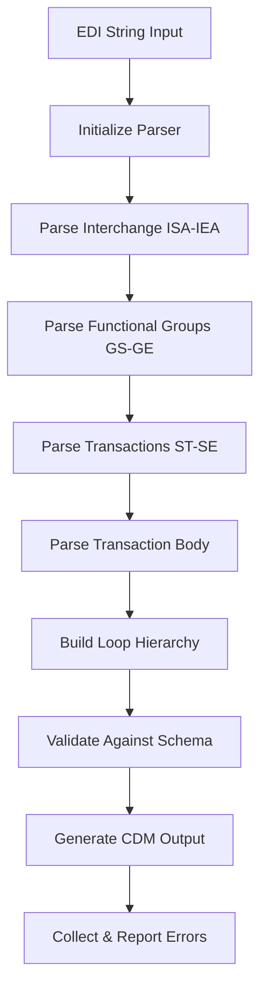

# Parsing Flow

This document details the step-by-step process of how the EDI parser processes an EDI string from raw input to structured CDM output.

## High-Level Flow



## Detailed Parsing Steps

### 1. **Initialization Phase**

```python
parser = EdiParser(edi_string=edi_content, schema=schema)
interchange = parser.parse()
```

**Process:**
- **Delimiter Detection**: Auto-detects element (*) and segment (~) delimiters from ISA header
- **Schema Loading**: Validates and loads implementation guide schema
- **Logging Setup**: Initializes parsing session logging
- **State Initialization**: Sets up internal parsing state

**Key Code Locations:**
- `EdiParser.__init__()` - Parser initialization
- `get_guide_version_from_edi()` - Version detection from EDI string

### 2. **Interchange Parsing (ISA-IEA)**

**Purpose**: Parse the outermost EDI envelope containing sender/receiver information and control numbers.

**Process:**
1. **ISA Header Parsing**:
   - Extract 16 fixed-position elements
   - Validate interchange control numbers
   - Set delimiters for subsequent parsing

2. **IEA Trailer Parsing**:
   - Validate functional group count
   - Verify interchange control number matches

**Data Structure Created:**
```python
CdmInterchange(
    header=CdmSegment(segment_id='ISA', ...),
    trailer=CdmSegment(segment_id='IEA', ...),
    functional_groups=[],
    errors=[]
)
```

### 3. **Functional Group Parsing (GS-GE)**

**Purpose**: Parse functional groups containing transaction sets of the same type.

**Process:**
1. **GS Header Parsing**:
   - Extract application sender/receiver codes
   - Parse functional group date/time
   - Determine transaction set type (e.g., HC for healthcare)

2. **Transaction Set Processing**:
   - Locate all ST-SE blocks within the functional group
   - Parse each transaction set individually

3. **GE Trailer Parsing**:
   - Validate transaction set count
   - Verify group control number matches

**Data Structure Created:**
```python
CdmFunctionalGroup(
    header=CdmSegment(segment_id='GS', ...),
    trailer=CdmSegment(segment_id='GE', ...),
    transactions=[],
    errors=[]
)
```

### 4. **Transaction Parsing (ST-SE)**

**Purpose**: Parse individual transaction sets (e.g., 837P claims).

**Process:**
1. **ST Header Parsing**:
   - Extract transaction set identifier (837)
   - Parse control number
   - Identify implementation guide version

2. **Body Segment Collection**:
   - Collect all segments between ST and SE
   - Preserve line numbers for error reporting
   - Handle multiple transaction sets in sequence

3. **SE Trailer Parsing**:
   - Validate segment count
   - Verify control number matches ST

**Data Structure Created:**
```python
CdmTransaction(
    header=CdmSegment(segment_id='ST', ...),
    trailer=CdmSegment(segment_id='SE', ...),
    body=CdmLoop(loop_id='ST_LOOP', ...),
    errors=[]
)
```

### 5. **Transaction Body Parsing**

This is the most complex phase, involving hierarchical loop structure detection and segment assignment.

#### 5.1 **Loop Structure Detection**

**Algorithm**: Hierarchical Level (HL) Segment Processing

```python
def _parse_loop_structure(segments: List, schema: StructureLoop):
    """
    Build hierarchical loop structure based on HL segments and schema rules.
    """
    hl_segments = find_hl_segments(segments)
    loop_hierarchy = build_hierarchy_tree(hl_segments)
    return assign_segments_to_loops(segments, loop_hierarchy, schema)
```

**Process:**
1. **HL Segment Identification**:
   - Find all HL segments in the transaction body
   - Extract hierarchical level ID, parent ID, and level code
   - Build parent-child relationships

2. **Loop Hierarchy Construction**:
   ```
   HL*1**20*1        -> 2000A (Billing Provider)
   HL*2*1*22*0       -> 2000B (Subscriber, parent=1)
   HL*3*1*22*1       -> 2000B (Subscriber, parent=1)
   HL*4*3*23*0       -> 2000C (Patient, parent=3)
   ```

3. **Loop Type Mapping**:
   - Level Code 20 = 2000A (Billing Provider)
   - Level Code 22 = 2000B (Subscriber)  
   - Level Code 23 = 2000C (Patient)

#### 5.2 **Segment Assignment**

**Algorithm**: Schema-Driven Segment Placement

```python
def _assign_segments_to_loops(segments, hierarchy, schema):
    """
    Assign non-HL segments to appropriate loops based on schema rules.
    """
    for segment in segments:
        if segment.segment_id == 'HL':
            continue  # Already processed
            
        target_loop = find_target_loop(segment, current_context, schema)
        target_loop.segments.append(segment)
```

**Rules:**
1. **Segment Context**: Segments belong to the most recent applicable loop
2. **Schema Validation**: Only valid segments are assigned to loops
3. **Required vs Optional**: Schema defines which segments are required
4. **Loop Boundaries**: Some segments trigger new loop creation

### 6. **Schema Validation**

Applied throughout parsing but particularly during loop and segment processing.

#### 6.1 **Structural Validation**

**Loop Level:**
- Required child loops exist
- Optional loops within cardinality limits
- Proper loop nesting hierarchy

**Segment Level:**
- Required segments present in loops
- Segment order conforms to schema
- Cardinality limits respected

#### 6.2 **Data Validation**

**Element Level:**
- Data type validation (AN, N0, N2, etc.)
- Length validation (min/max)
- Format validation (CCYYMMDD, HHMM, etc.)
- Code set validation for ID elements

**Syntax Rules:**
- Complex conditional validation
- Cross-element validation rules
- Business logic enforcement

### 7. **Error Collection & Reporting**

**Error Types:**
1. **Structural Errors**: Missing required loops/segments
2. **Data Errors**: Invalid element values or formats  
3. **Business Rule Errors**: Syntax rule violations
4. **Parsing Errors**: Malformed EDI structure

**Error Context:**
```python
CdmValidationError(
    message="Element 'BHT04': Value is shorter than min length 8.",
    line_number=25,
    segment_id="BHT", 
    element_xid="BHT04",
    is_identifier_error=False
)
```

**Error Collection:**
```python
def _collect_all_errors(interchange):
    """Traverse entire CDM tree and collect all validation errors."""
    errors = []
    # Collect from interchange, functional groups, transactions, loops, segments
    return errors
```

## Error Handling Strategy

### Continue-on-Error Approach

The parser follows a **fault-tolerant** strategy:

1. **Parse Structure First**: Always attempt to build the hierarchical structure
2. **Validate After**: Apply validation rules to parsed structure
3. **Collect Don't Halt**: Collect errors but continue parsing
4. **Isolate Errors**: Errors in one transaction don't affect others

### Transaction-Level Isolation

```python
for transaction_segments in functional_group.transactions:
    try:
        transaction = parse_transaction(transaction_segments)
        transactions.append(transaction)
    except Exception as e:
        # Log error but continue with next transaction
        logger.error(f"Transaction parsing failed: {e}")
        continue
```

## Performance Considerations

### Streaming Processing
- **Incremental Parsing**: Processes segments as encountered
- **Memory Efficient**: Doesn't load entire EDI into memory at once
- **Early Validation**: Validates as it parses to fail fast on critical errors

### Schema Caching
- **Schema Reuse**: Implementation guide schemas cached after first load
- **Validation Rule Caching**: Complex syntax rules compiled once per schema

### Optimization Points
- **HL Segment Indexing**: Pre-indexes HL segments for hierarchy building
- **Segment Lookup**: Uses efficient data structures for segment access
- **Error Deduplication**: Avoids duplicate error reporting

## Example: Complete Parse Flow

```python
# Input: 837P EDI String
edi_string = """
ISA*00*          *00*          *ZZ*SENDER     *ZZ*RECEIVER   *240715*1200*^*00501*000000001*0*P*>~
GS*HC*SENDER*RECEIVER*20240715*1200*1*X*005010X222A1~
ST*837*0001*005010X222A1~
BHT*0019*00*BATCH01*20240715*1200*CH~
NM1*41*2*BILLING PROVIDER*****46*SUBMITTER1~
...
SE*21*0001~
GE*1*1~
IEA*1*000000001~
"""

# 1. Initialize Parser
parser = EdiParser(edi_string=edi_string, schema=schema)

# 2. Parse (executes full flow)
interchange = parser.parse()

# 3. Result Structure
interchange.functional_groups[0].transactions[0].body.get_loop("2000A")
```

## Next Steps

- **[Data Structures](./03-data-structures.md)**: Deep dive into CDM components
- **[Error Handling](./04-error-handling.md)**: Comprehensive error handling strategies
- **[Usage Examples](./06-usage-examples.md)**: Practical parsing examples