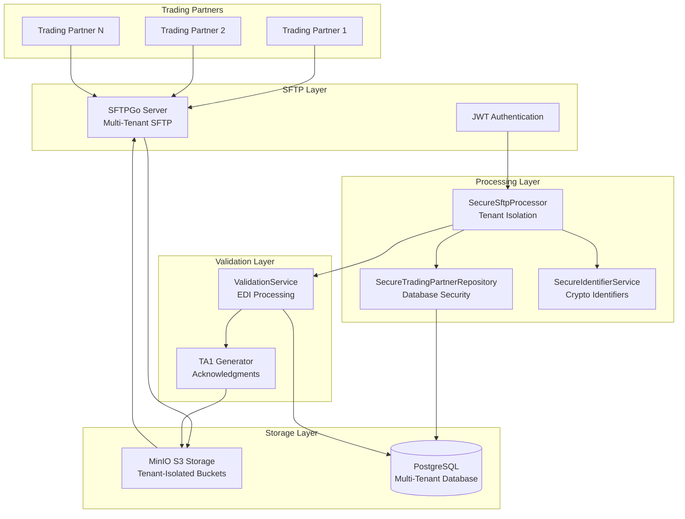

# SFTP File Processing - System Overview

## Introduction

The EDI Lens SFTP File Processing system provides secure, multi-tenant SFTP-based EDI file processing capabilities alongside the existing API validation system. Trading partners can upload EDI files to designated SFTP directories for automated processing, with complete isolation between tenants and comprehensive security controls.

## Architecture Overview



## Key Features

### 🔒 Enterprise-Grade Security
- **Mandatory Authentication**: JWT tokens required for all SFTP operations
- **Multi-Tenant Isolation**: Complete separation between tenant data and operations
- **Cross-Tenant Protection**: Unauthorized access attempts blocked and logged
- **Comprehensive Audit Logging**: All operations logged with full security context
- **Secure Identifiers**: Cryptographically secure, non-predictable identifier generation

### 🏢 Multi-Tenant Architecture
- **Tenant-Isolated Storage**: S3 key prefixes ensure complete data separation
- **Database Isolation**: All queries automatically scoped to authenticated tenant
- **User Management**: Tenant-specific SFTP users and credentials
- **Resource Quotas**: Per-tenant resource limits and monitoring

### 📁 File Processing Workflow
- **Automated Discovery**: Scheduled file discovery in tenant-specific directories
- **EDI Validation**: Full EDI validation using existing validation engine
- **Response Generation**: TA1 acknowledgments delivered to partner outbound directories
- **Archive Management**: Processed files archived in tenant-isolated locations

### 🚀 Production Ready
- **Zero Downtime**: Additive to existing API processing (no breaking changes)
- **Comprehensive Testing**: 181/181 tests passing (unit, integration, e2e)
- **Error Handling**: Robust error handling with retry logic and dead letter queues
- **Monitoring**: Health checks, metrics, and observability

## System Components

### SFTPGo Server
- **Technology**: SFTPGo v2.6 with ARM64 support
- **Storage Backend**: MinIO S3-compatible object storage
- **Authentication**: Password and SSH key authentication
- **Management**: REST API and web-based administration interface

### Secure Processing Services
- **SecureSftpProcessor**: Main service with mandatory authentication context
- **SecureTradingPartnerRepository**: Database access with tenant isolation
- **SecureIdentifierService**: Cryptographically secure ID generation

### Storage Architecture
- **MinIO S3**: Object storage with tenant-specific key prefixes
- **PostgreSQL**: Multi-tenant database with automatic tenant scoping
- **File Organization**: Structured directories for inbound, outbound, and archive

## Directory Structure

```
sftp/
└── {tenant_id}/
    └── {sftp_username}/
        ├── in/          # Inbound files from trading partners
        ├── out/         # Outbound responses (TA1, 999)
        └── .archive/    # Processed file archive
```

## Security Model

### Authentication Flow
1. **JWT Token Validation**: All operations require valid JWT tokens
2. **Tenant Authorization**: User access validated against requested tenant
3. **Permission Checking**: Role-based access control (sftp:read, sftp:process)
4. **Operation Logging**: All actions logged with security context

### Tenant Isolation
- **Database Level**: All queries automatically filtered by tenant_id
- **Storage Level**: S3 key prefixes prevent cross-tenant access
- **Processing Level**: File operations scoped to authenticated tenant
- **Error Handling**: No information leakage across tenant boundaries

## Integration Points

### Existing API System
- **Zero Breaking Changes**: All existing API functionality preserved
- **Shared Validation Engine**: Uses same EDI validation logic
- **Common Database**: Extends existing database schema
- **Unified Audit**: Consistent audit logging across API and SFTP

### External Systems
- **Keycloak Integration**: JWT token validation and user management
- **Monitoring Systems**: Structured logging for observability platforms
- **Object Storage**: Compatible with S3-compliant storage systems

## Deployment Architecture

### Development Environment
- **Docker Compose**: Complete development stack with all services
- **Local Storage**: MinIO for S3-compatible object storage
- **Test Users**: Pre-configured SFTP users for testing

### Production Environment
- **Container Orchestration**: Kubernetes or Docker Swarm ready
- **External Storage**: AWS S3, Google Cloud Storage, or Azure Blob
- **High Availability**: Multi-replica deployment with load balancing
- **Security Hardening**: Production security configurations

## Benefits

### For Trading Partners
- **Familiar Interface**: Standard SFTP protocol for file uploads
- **Automated Processing**: Files processed automatically upon upload
- **Immediate Feedback**: TA1 acknowledgments delivered to outbound directory
- **Secure Isolation**: Complete separation from other partners' data

### For System Administrators
- **Centralized Management**: Single interface for all SFTP configurations
- **Comprehensive Monitoring**: Detailed logging and audit trails
- **Scalable Architecture**: Horizontal scaling capabilities
- **Security Controls**: Enterprise-grade security with tenant isolation

### For Developers
- **Clean APIs**: Well-documented REST APIs for configuration
- **Secure CLI Tools**: Authenticated command-line interfaces
- **Comprehensive Testing**: Full test coverage for all components
- **Zero Regression**: Existing functionality unchanged

## Next Steps

- [Getting Started](02-getting-started.md) - Set up your development environment
- [Authentication & Security](03-authentication-security.md) - Understand the security model
- [File Processing Workflow](04-file-processing-workflow.md) - Learn the processing flow