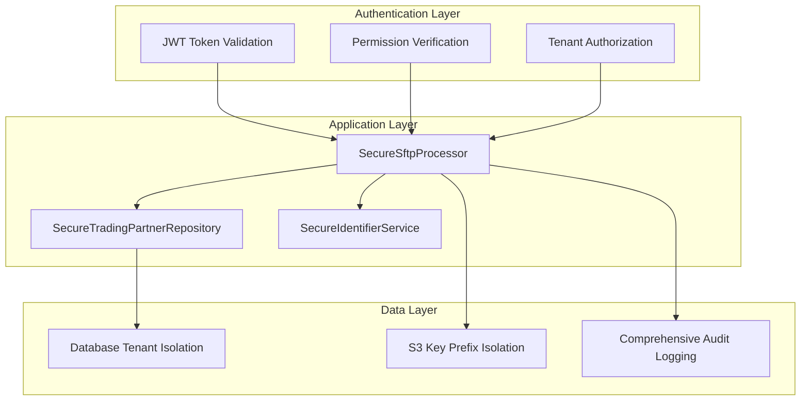
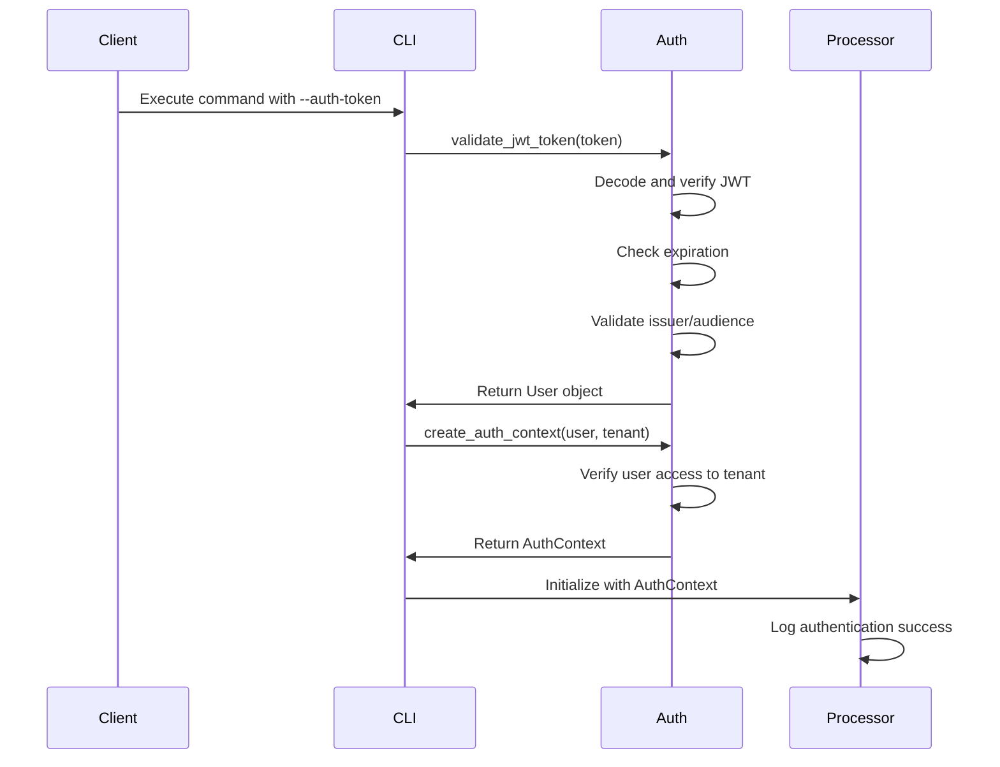
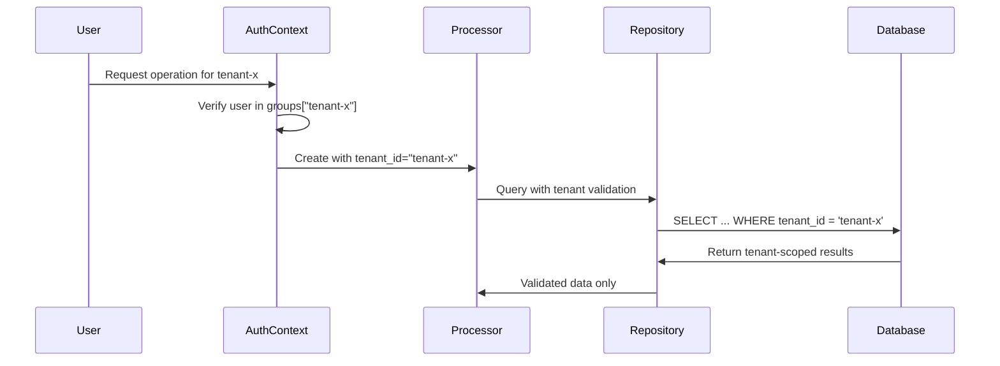

# Authentication & Security

The EDI Lens SFTP system implements enterprise-grade security with multi-tenant isolation, mandatory authentication, and comprehensive audit logging. This document details the security architecture and authentication mechanisms.

## Security Architecture

### Defense in Depth

The system implements multiple layers of security:



### Key Security Principles

1. **Zero Trust**: No operation is trusted without explicit authentication
2. **Principle of Least Privilege**: Users can only access their authorized tenant data
3. **Defense in Depth**: Multiple security layers prevent single points of failure
4. **Audit Everything**: All operations are logged for security monitoring
5. **Fail Secure**: System fails to secure state on any security violation

## Authentication System

### JWT Token-Based Authentication

All SFTP operations require valid JWT tokens with specific claims:

```json
{
  "sub": "user-id",
  "preferred_username": "username",
  "email": "user@example.com",
  "groups": ["tenant-a", "tenant-b"],
  "realm_access": {
    "roles": ["sftp:read", "sftp:process", "admin"]
  },
  "iat": 1754270569,
  "exp": 1754277769,
  "iss": "edi-lens",
  "aud": "edi-lens-api"
}
```

#### Required Claims

- **`sub`**: Unique user identifier
- **`preferred_username`**: Human-readable username
- **`groups`**: List of tenants the user can access
- **`realm_access.roles`**: Permissions for SFTP operations
- **`exp`**: Token expiration time
- **`iss`**: Token issuer (must match configured issuer)

#### Required Permissions

- **`sftp:read`**: List partners and discover files
- **`sftp:process`**: Process files and generate responses
- **`admin`**: Administrative operations (optional)

### Token Validation Process



## Multi-Tenant Isolation

### Tenant Isolation Architecture

The system ensures complete isolation between tenants at multiple levels:

#### 1. Database Level Isolation

All database queries are automatically scoped to the authenticated user's tenant:

```python
# Example: SecureTradingPartnerRepository
async def get_by_id(self, *, partner_id: int):
    query = (
        select(TradingPartner)
        .filter_by(id=partner_id, tenant_id=self.tenant_id)  # ✅ ENFORCED
    )
    # Cross-tenant access automatically prevented
```

#### 2. Storage Level Isolation

S3 object keys use tenant-specific prefixes:

```
sftp/
├── tenant-a/
│   ├── partner-1/
│   │   ├── in/
│   │   ├── out/
│   │   └── archive/
│   └── partner-2/
└── tenant-b/
    └── partner-3/
```

#### 3. Processing Level Isolation

All file operations validate tenant ownership:

```python
# Example: SecureSftpProcessor
def _validate_tenant_access(self, requested_tenant_id: str):
    if requested_tenant_id != self.tenant_id:
        # Log security violation
        self._log_operation(SftpOperation(
            operation_type="security_violation",
            status="DENIED",
            details={"violation_type": "cross_tenant_access_attempt"}
        ))
        raise SecurityError("Access denied")
```

### Tenant Authorization Flow



## Security Services

### SecureIdentifierService

Generates cryptographically secure, non-predictable identifiers to prevent enumeration attacks:

```python
class SecureIdentifierService:
    def generate_sftp_username(self, tenant_id: str, partner_name: str) -> str:
        # Uses cryptographic hash + timestamp + random components
        tenant_hash = hashlib.sha256(tenant_id.encode()).hexdigest()[:8]
        partner_hash = hashlib.sha256(partner_name.encode()).hexdigest()[:6]
        timestamp_part = self._generate_timestamp_component()
        random_part = self._generate_random_string(6, allowed_chars)
        
        identifier = f"sftp_{tenant_hash}_{partner_hash}_{timestamp_part}_{random_part}"
        return self._ensure_uniqueness(identifier)
```

#### Features:
- **Non-enumerable**: Cannot guess other tenant/partner identifiers
- **Collision prevention**: Automatic uniqueness checking
- **Audit logging**: All generation operations logged
- **Configurable formats**: Different formats for different identifier types

### Audit Logging System

Comprehensive audit logging captures all security-relevant events:

```python
@dataclass
class SftpOperation:
    operation_type: str    # "list_partners", "process_file", "security_violation"
    tenant_id: str        # Authenticated tenant
    user_id: str          # Authenticated user
    partner_id: Optional[int]  # Target partner (if applicable)
    file_key: Optional[str]    # File being processed
    status: str           # "SUCCESS", "ERROR", "DENIED"
    details: Dict[str, Any]    # Additional context
```

#### Logged Operations:
- **Authentication events**: Login attempts, token validation
- **Authorization events**: Permission checks, tenant access attempts
- **File operations**: File discovery, processing, archiving
- **Security violations**: Cross-tenant access attempts, permission failures
- **Administrative actions**: Configuration changes, user management

## Error Handling & Security

### Secure Error Messages

The system prevents information disclosure through error messages:

```python
# ❌ BAD: Leaks information about other tenants
raise ValueError(f"Partner 'XYZ' not found in tenant 'other-tenant'")

# ✅ GOOD: No information leakage
raise SecurityError("Partner not found in your tenant")
```

### Security Violation Handling

When security violations are detected:

1. **Immediate Denial**: Operation stopped immediately
2. **Security Logging**: Violation logged with full context
3. **No Information Leakage**: Generic error message returned
4. **Monitoring Alert**: Security team notified (in production)

```python
# Example security violation log entry
{
    "timestamp": "2023-08-03T21:39:24.047Z",
    "level": "WARNING",
    "operation_type": "security_violation",
    "tenant_id": "tenant-a",
    "user_id": "test-user-123",
    "status": "DENIED",
    "details": {
        "violation_type": "cross_tenant_access_attempt",
        "requested_tenant": "tenant-c",
        "user_tenant": "tenant-a"
    }
}
```

## Production Security Considerations

### Token Management

**Development:**
- Test tokens can be generated locally
- Short expiration times (2 hours)
- No signature verification for testing

**Production:**
- Tokens issued by Keycloak or similar OIDC provider
- Proper signature verification with rotating keys
- Appropriate expiration times (8-24 hours)
- Refresh token rotation

### Network Security

**Development:**
- Services exposed on localhost
- No TLS for internal communication

**Production:**
- TLS encryption for all external connections
- Internal service mesh with mTLS
- Network segmentation and firewalls
- Rate limiting and DDoS protection

### Storage Security

**Development:**
- MinIO with simple credentials
- Local storage with basic access controls

**Production:**
- AWS S3 with IAM roles and policies
- Encryption at rest and in transit
- Bucket policies for additional protection
- Cross-region replication for disaster recovery

### Monitoring & Alerting

**Security Events to Monitor:**
- Failed authentication attempts
- Cross-tenant access violations
- Unusual file processing patterns
- Administrative action patterns
- Resource usage anomalies

**Recommended Alerts:**
- Multiple failed authentications from same user/IP
- Any cross-tenant access attempts
- Large file uploads outside business hours
- Database query patterns indicating potential attacks

## Security Testing

### Authentication Testing

```bash
# Test valid authentication
./run.sh dev:sftp:process --auth-token "$VALID_JWT" --tenant tenant-a --list-partners
# Expected: Success

# Test cross-tenant access (should fail)
./run.sh dev:sftp:process --auth-token "$TENANT_A_JWT" --tenant tenant-b --list-partners  
# Expected: Authentication failed

# Test expired token (should fail)
./run.sh dev:sftp:process --auth-token "$EXPIRED_JWT" --tenant tenant-a --list-partners
# Expected: Token validation failed
```

### Tenant Isolation Testing

The test suite includes comprehensive tenant isolation tests:

- **Cross-tenant partner access**: Verify users cannot access other tenants' partners
- **Cross-tenant file access**: Verify file processing is tenant-scoped
- **Database isolation**: Verify queries are properly filtered
- **Storage isolation**: Verify S3 key prefixes prevent cross-tenant access

## Security Checklist

### Deployment Security

- [ ] JWT signature verification enabled
- [ ] TLS encryption for all external connections
- [ ] Database connections encrypted
- [ ] Object storage encryption enabled
- [ ] Network segmentation implemented
- [ ] Rate limiting configured
- [ ] Security monitoring enabled
- [ ] Audit log retention configured

### Operational Security

- [ ] Regular security reviews conducted
- [ ] Penetration testing performed
- [ ] Dependency vulnerability scanning
- [ ] Security incident response plan
- [ ] Access control reviews
- [ ] Audit log monitoring
- [ ] Backup and recovery testing

## Next Steps

- [File Processing Workflow](04-file-processing-workflow.md) - Learn the processing flow
- [API Reference](05-api-reference.md) - Explore secure APIs
- [Administration](07-administration.md) - Security administration tasks